# Warning Symbol Detection on Medicine Packaging (WSDF)

🎥 **Demo Video (UI Walkthrough)**


https://github.com/user-attachments/assets/3b2aa1c4-0200-41c5-a202-570dc91ef83d


---

## 1. Introduction

This repository implements the **Warning Symbol Detection Framework (WSDF)** for detecting standardized **pharmaceutical warning symbols** on medicine packaging.

The framework combines:

* **SAM3** for package/panel localization (mask extraction)
* **Synthetic dataset generation** by inserting symbols into valid panel regions
* **YOLOv12n** (lightweight detector) for final symbol detection
* **Gradio UI** for interactive inference

This project supports **7 warning symbol classes** and provides training + evaluation + inference + UI.

---

## 2. Supported Warning Symbols (7 Classes)

The system detects the following warning symbols:

1. **breastfeeding**
2. **dont_drink**
3. **drowsiness**
4. **external_use_only**
5. **pregnant**
6. **protect_from_light**
7. **temperature**

## Supported Warning Symbols

<div align="center">

<table>
<tr>
<td align="center">
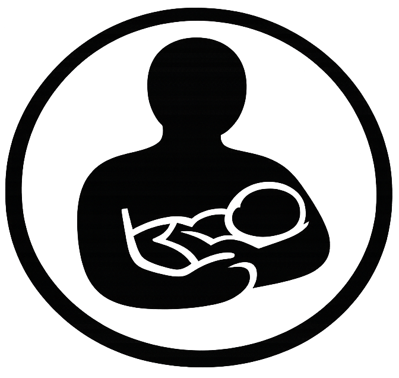<br/>
<b>Breastfeeding</b>
</td>

<td align="center">
<br/>
<b>Do Not Drink</b>
</td>

<td align="center">
<br/>
<b>Drowsiness</b>
</td>
</tr>

<tr>
<td align="center">
<br/>
<b>External Use Only</b>
</td>

<td align="center">
<br/>
<b>Pregnant</b>
</td>

<td align="center">
<br/>
<b>Protect From Light</b>
</td>
</tr>

<tr>
<td align="center" colspan="3">
<br/>
<b>Temperature</b>
</td>
</tr>

</table>

</div>

---

## 3. Synthetic Logo Placement on Medicine Packages (SAM3 → Mask → Placement)

Since real annotated warning-symbol datasets are limited, this project generates a synthetic dataset by placing warning logos on real medicine package images.

### 3.1 Step-by-step Process

1. **Input:** Raw medicine package image
2. **SAM3 Segmentation:** Detect package/panel mask
3. **Mask Extraction:** Extract package region (panel position)
4. **Valid Placement Region Selection:** Choose flat/clean area inside panel
5. **Overlay Warning Logo:** Place symbol + auto-generate bounding box label

<div align="center">

<table>
<tr>
<td align="center">
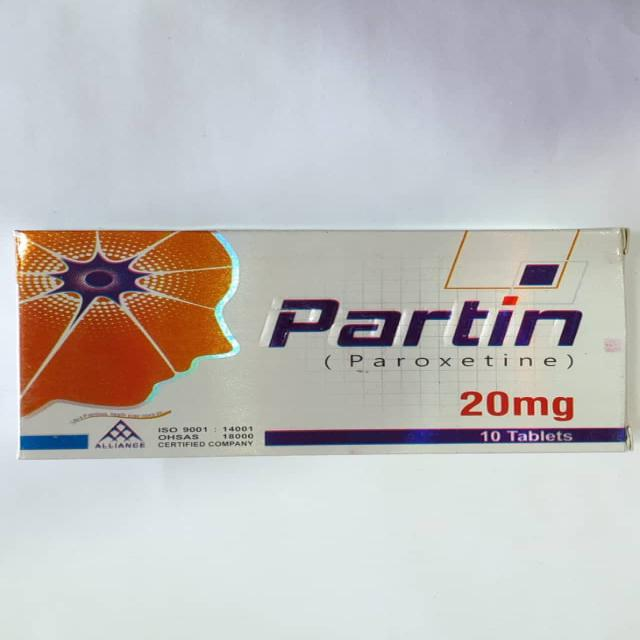<br/>
<b>Raw package image</b>
</td>

<td align="center">
<br/>
<b>SAM3 mask</b>
</td>

<tr>
<td align="center">
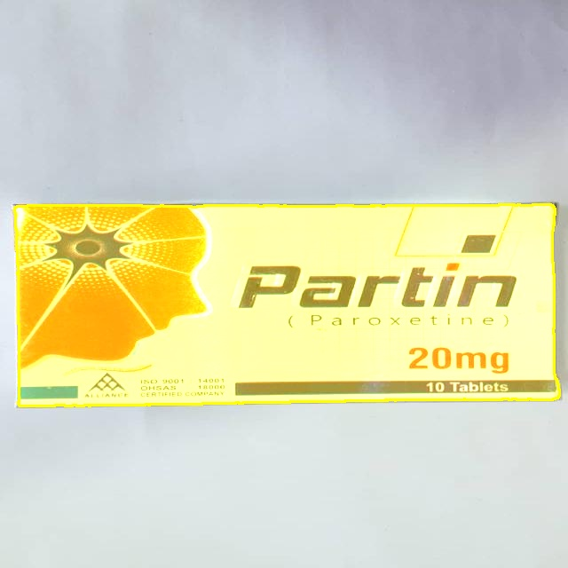<br/>
<b>Panel/ROI highlighted</b>
</td>

<td align="center">
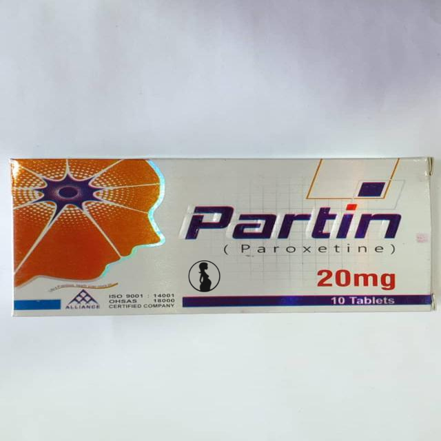<br/>
<b>Final logo overlay result</b>
</td>


</table>

</div>

### 3.2 SAM3 Repo Used

This implementation uses **SAM3** for mask-based package localization:

* [https://github.com/facebookresearch/sam3](https://github.com/facebookresearch/sam3)

---

## 4. Installation

### 4.1 Clone the Repository

```bash
git clone git@github.com:HSAkash/medical_packaging_symbols_detection.git
cd medical_packaging_symbols_detection
```

### 4.2 Create Virtual Environment

```bash
python -m venv env
```

Activate:

**Windows**

```bash
env\Scripts\activate
```

**Linux / Mac**

```bash
source env/bin/activate
```

### 4.3 Install Dependencies

```bash
pip install -r requirements.txt
```

---

## 5. How to Run

### 5.1 Run Template

```bash
python template.py
```

### 5.2 Run Using Python

```bash
python main.py
```

### 5.3 Run Using DVC (Reproducible Pipeline)

Initialize DVC:

```bash
dvc init
```

Run pipeline:

```bash
dvc run
```

Reproduce pipeline:

```bash
dvc repro
```

### 5.4 Run the UI (Gradio)

```bash
python app.py
```

Then open the URL shown in the terminal.
<div align="center">
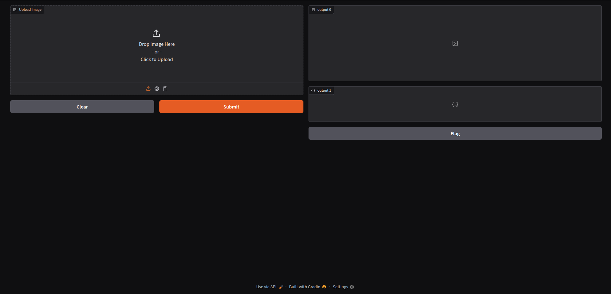<br/>
</div>
---

## 6. Training (YOLOv12n)

The synthetic dataset is used to train a **YOLOv12n** lightweight detector.

Training includes:

* multi-class detection (7 classes)
* rotation augmentation (0°, 90°, 180°, 270°)
* automatic bounding-box annotation from logo placement

---

## 7. Training Results

<div align="center">
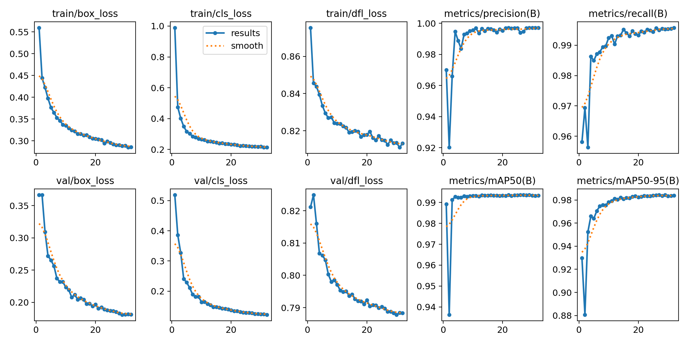<br/>
</div>

### 7.1 Curves

<div align="center">

<table>
<tr>
<td align="center">
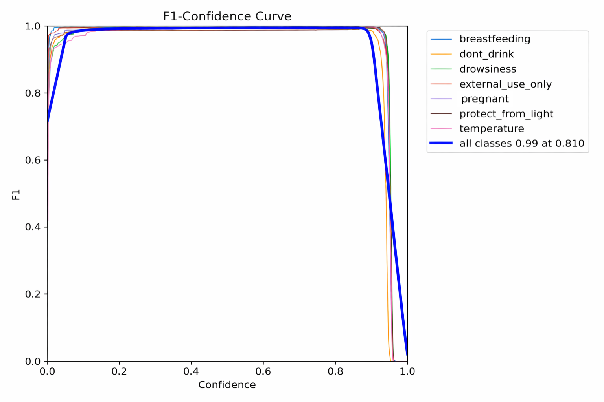<br/>
<b>F1–Confidence curve</b>
</td>

<td align="center">
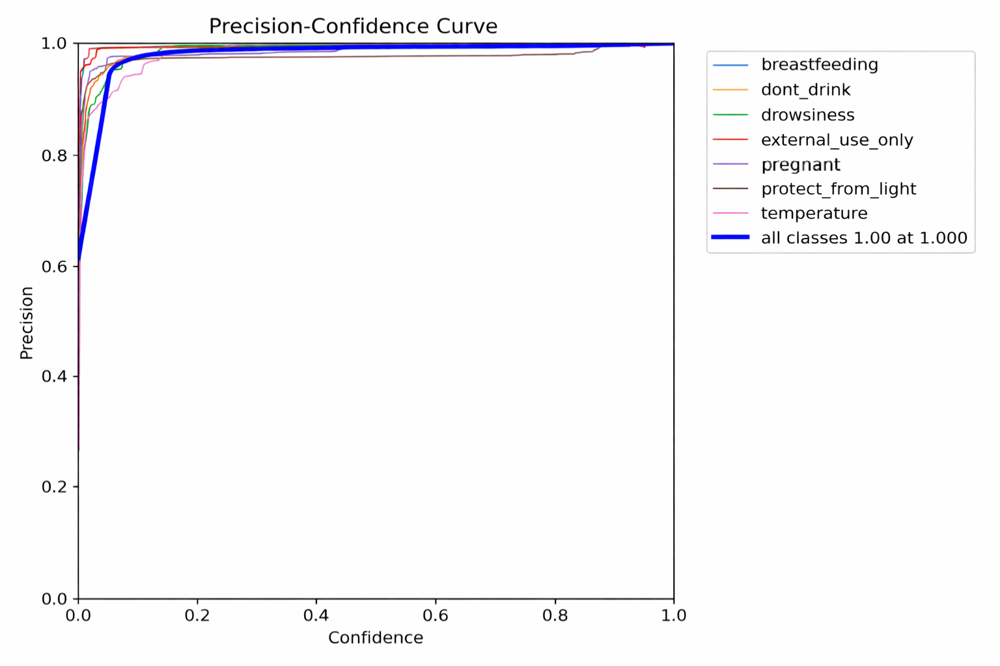<br/>
<b>Precision–Confidence curve</b>
</td>

<tr>
<td align="center">
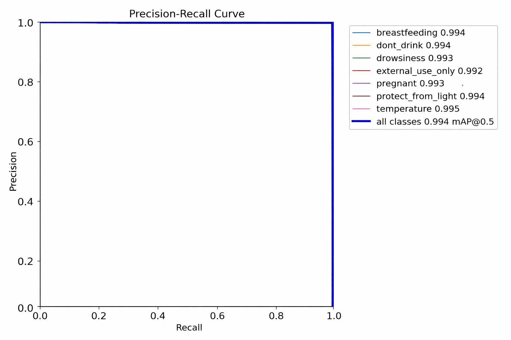<br/>
<b>Precision–Recall curve</b>
</td>

<td align="center">
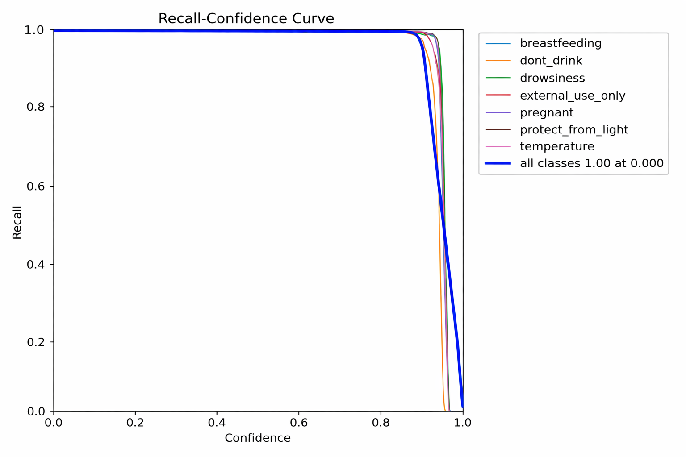<br/>
<b>Recall–Confidence curve</b>
</td>


</table>

</div>

### 7.2 Confusion Matrix

<div align="center">

<table>
<tr>
<td align="center">
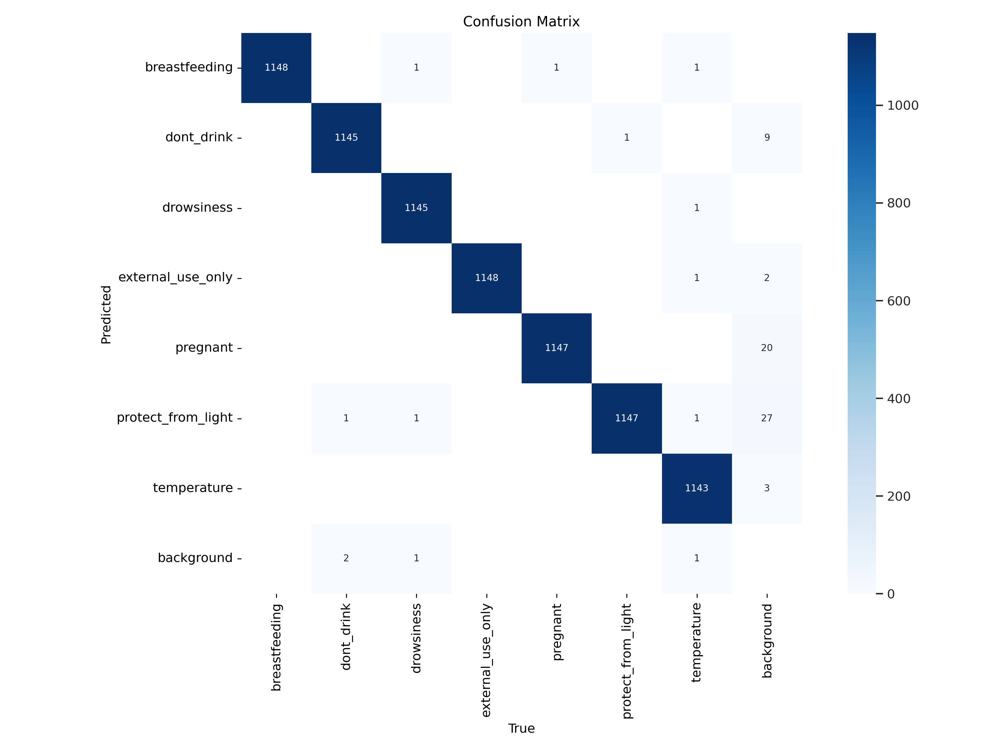<br/>
<b>Confusion Matrix (raw) (val)</b>
</td>

<td align="center">
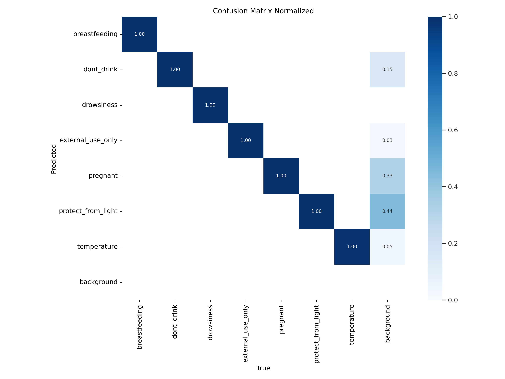<br/>
<b>Confusion Matrix (normalized) (val)</b>
</td>
</table>

</div>

## 8. Prediction / Detection Results (After Training)

Below are example detections for all 7 warning symbols after training.

<div align="center">

<table>
<tr>
<td align="center">
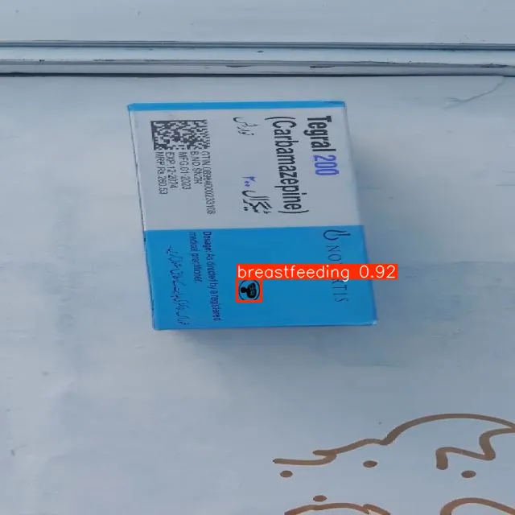<br/>
<b>Breastfeeding</b>
</td>

<td align="center">
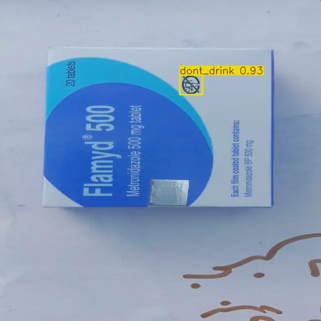<br/>
<b>Do Not Drink</b>
</td>

<td align="center">
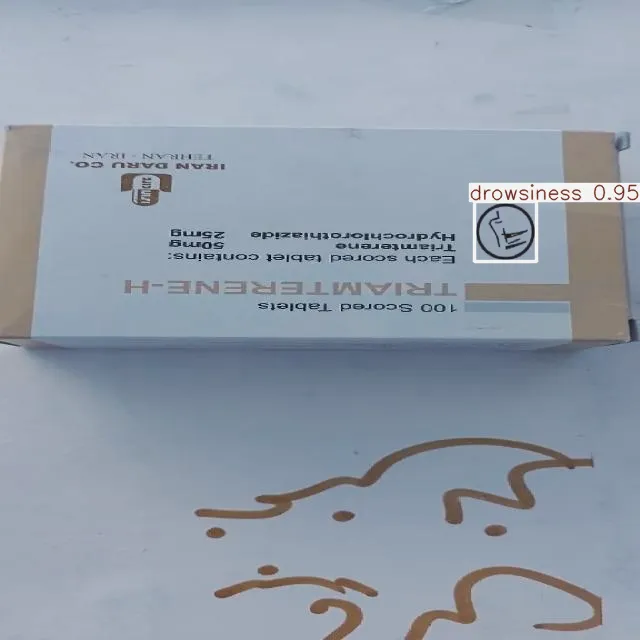<br/>
<b>Drowsiness</b>
</td>
</tr>

<tr>
<td align="center">
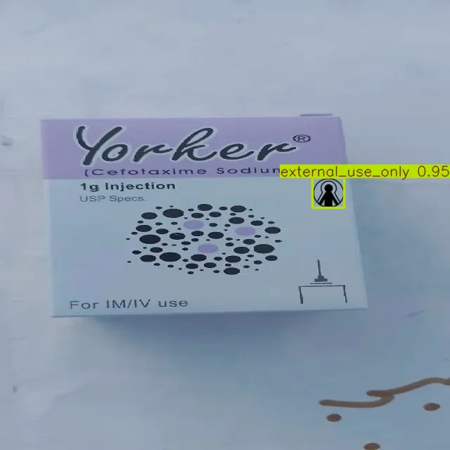<br/>
<b>External Use Only</b>
</td>

<td align="center">
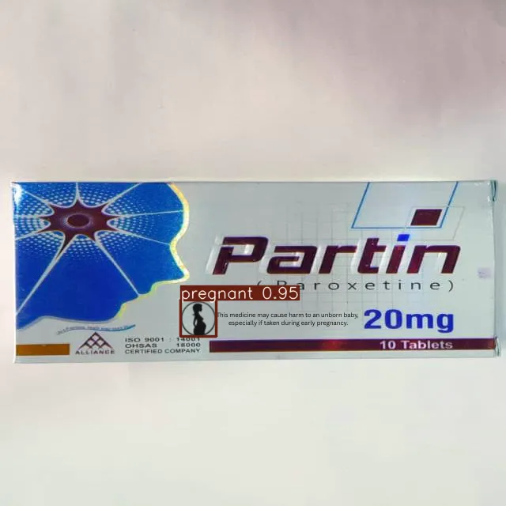<br/>
<b>Pregnant</b>
</td>

<td align="center">
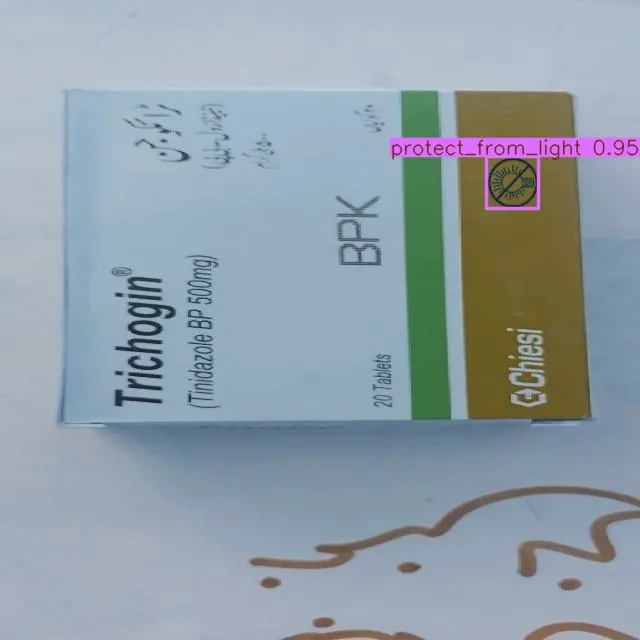<br/>
<b>Protect From Light</b>
</td>
</tr>

<tr>
<td align="center" colspan="3">
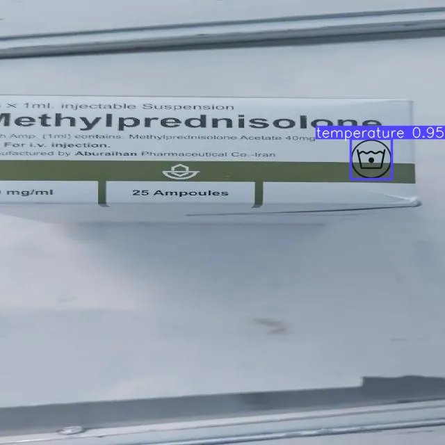<br/>
<b>Temperature</b>
</td>
</tr>

</table>

</div>

---

## 9. Output Format (Example)

The system returns both:

1. **Image output** with bounding box + label + confidence
2. **JSON output** with class name and bounding-box coordinates

Example format:

```json
{
  "class_name": "pregnant",
  "position": {
    "x1": 228.49,
    "y1": 379.87,
    "x2": 273.29,
    "y2": 425.29
  }
}
```

---


## 10. License

This project is licensed under the Apache License, Version 2.0.

You may obtain a copy of the License at:

http://www.apache.org/licenses/LICENSE-2.0

See the [LICENSE](LICENSE) file for the complete license text.

---

## 11. Author

**HSAkash**
Medical Packaging Warning Symbol Detection (WSDF)

## 12. Links
* [Dataset](https://doi.org/10.34740/kaggle/ds/9531915): https://doi.org/10.34740/kaggle/ds/9531915

```
@misc{hemel_sharker_akash_2026,
	title={MedLogoSignDB},
	url={https://www.kaggle.com/ds/9531915},
	DOI={10.34740/KAGGLE/DS/9531915},
	publisher={Kaggle},
	author={Hemel Sharker Akash},
	year={2026}
}
```
